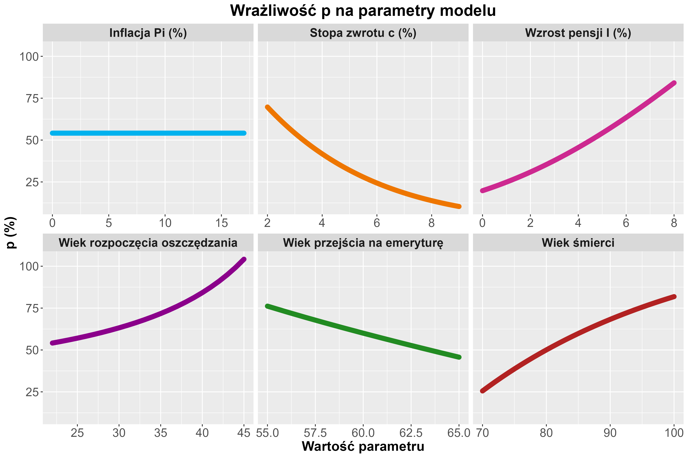

```{r setup, include=FALSE}
knitr::opts_chunk$set(
  dev = "cairo_pdf",
  echo = FALSE,
  warning = FALSE,
  message = FALSE,
  comment = FALSE
  
  #fig.width = 8,
 # fig.height = 6,
  #fig.align = "center"
)

options(digits = 5)

set.seed(17)

library(dplyr)
library(ggplot2)
library(data.table)
library(readxl)
library(tidyr)
library(knitr)
library(kableExtra)
library(reshape2)
library(gridExtra)
library(ggtext)
library(latex2exp)
library(DescTools)
library(ggpubr)
library(parallel)
library(scales)

#Zmienne globalne

Pi <- 0.02   # roczna stopa inflacji
c  <- 0.03   # roczna stopa zwrotu z obligacji
I  <- 0.05   # roczna stopa wzrostu pensji
t0 <- 0      # początek oszczędzania
t  <- 40     # przejście na emeryturę
td <- 60     # rok śmierci

```

# Wstęp

Celem projektu jest lepsze zrozumienie natury oszczędności emerytalnych i empiryczne obliczenie zmienności wartości pieniądza w czasie w kontekście emerytalnym.

W projekcie zaplanowana zostanie moja własna emerytura pod kątem finansowym.

W rozdysponowywaniu pieniędzy dostępna jest jedna inwestycja - obligacje, które są związane ze stopą inflacji. 


Wprowadźmy oznaczenia:

\begin{itemize}
\item {$\Pi$} - roczna realna stopa inflacji,
\item {c} - roczna realna stopa zwrotu z obligacji,
\item {I} -  roczna realna stopa wzrostu pensji,
\item {$t_0$} - rok rozpoczęcia inwestowania funduszy na emeryturę,
\item {T} - rok przejścia na emeryturę,
\item {$t_d$} - rok śmierci,
\item {p} - procent odkładanej pensji na emeryturę w każdym miesiącu.
\end{itemize}

\begin{tcolorbox}[
  colback=blue!10,
  colframe=blue!70!black,
  boxrule=0.8pt,
  arc=3mm
]
Dane początkowe:
\[
\Pi = 0.02,\quad
c = 0.03,\quad
I = 0.05,\quad
t_0 = 0,\quad
T = 40,\quad
t_d = 60.
\]
\end{tcolorbox}

\newpage

# $\S_1$ Procent odkładanej pensji p

Przy powyższych danych początkowych obliczone zostanie p takie, że pierwsza emerytura będzie równa ostatniej
pensji, a następnie będzie rosnąć w takim samym tempie jak inflacja.

Warto zaznaczyć, że realna stopa $\approx$ stopa nominalna - inflacja.


```{r zadanie1}

#Zadanie 1


emerytura_p <- function(Pi = 0.02,
                        c = 0.03,
                        I = 0.05,
                        t0 = 0,
                        t = 40,  #Rok przejścia na emeryturę od teraźniejszości. zał. t0=0 to tak na prawdę moment obecny w którym mamy 22 lata. Małe t dlatego, że T w Rstudio oznacza TRUE.
                        td = 60,
                        wyplata_t0 = 1) { # początkowa miesieczna wypłata "jednostka wypłaty"
  

  msc_o <- (t - t0) * 12     # liczba miesięcy, w których oszczędzamy na emeryturę/ pracujemy do emerytury
  msc_e <- (td - t) * 12     # liczba miesiecy, w których jesteśmy na emeryturze/ otrzymujemy wypłaty emerytalne
  
  
  Pi_msc <- (1 + Pi)^(1 / 12) - 1  # miesięczna realna stopa inflacji
  c_msc  <- (1 + c)^(1 / 12) - 1   # miesięczna realna stopa zwrotu z obligacji
  I_msc  <- (1 + I)^(1 / 12) - 1   # miesięczna realna stopa wzrostu pensji
  

  wyplata_t <- wyplata_t0 * (1 + I_msc)^(msc_o - 1) # ostatnia miesięczna wypłata ("w jednostkach wypłaty" tzn. później można ją przemnożyć przez dowolną kwotę pierwszej wypłaty(w np. zł), obliczenia są dla sytuacji ogólnej)
  
  #USUN , ale i tak p nie zależy od wysokości pierwszej wypłaty)
  
  
  # Porównujemy PV_T ostatniej pensji z PV_T pierwszej emerytury (tzn. między momentem wypłaty ost. pensji i momentem wypłaty pierwszej emeryt.      wciąż naliczają nam się odsetki z inwestowania w obligację)
  # pierwsza_emerytura = wyplata_T * (1 + c_msc)
  
  pierwsza_emerytura <- wyplata_t * (1 + c_msc)
  
  
  # Kapitał potrzebny na początku emerytury czyli 'chwilę po momencie wypłaty' ostatniej pensji
  # PV wypłat emerytalnych (dyskontowanie)
  
  q_em <- 1  / (1 + c_msc)
  K_t <- (pierwsza_emerytura * (1 - q_em^msc_e)) / c_msc  # kapitał potrzebny na wypłaty emerytalne, na początku emerytury
  
  
  
  # 'FV' składek z pensji (akumulacja) | FV to tak na prawdę p * wypłata0 * wsp_akum
  q_o <- (1 + I_msc) / (1 + c_msc)
 # wsp_akum <- (1 + c_msc)^(msc_o - 1) * (1 - q_o^msc_o) / (1 - q_o)  #współczynnik akumulacji
  
  #chcemy 'równanie równoważności' między K_t zdyskontowanym (emerytura) i zakumulowanym (pensja)
  # K_t = FV_składek = p * wypłata0 * wsp_akum
  
  # warunek na stabilność #współczynnika akumulacji
  
  if (abs(1 - q_o) < 1e-6) {
    wsp_akum <- msc_o * (1 + c_msc)^(msc_o - 1)    # dokładne wyjaśnienie w pliku dodatki.pdf
  } else {
    wsp_akum <- (1 + c_msc)^(msc_o - 1) * (1 - q_o^msc_o) / (1 - q_o)
  }
  
  
  p <- K_t / (wyplata_t0 * wsp_akum) # procent pensji odkładany miesięcznie

  
  list(
    p = p,
    p_procentowo = 100 * p,
    wyplata_t = wyplata_t,
    pierwsza_emerytura = pierwsza_emerytura,
    roznica_emer_wyplata_proc_msc = ((pierwsza_emerytura / wyplata_t) - 1 )* 100,
    roznica_emer_wyplata_proc_rok = ((pierwsza_emerytura / wyplata_t) - 1 ) * 100 * 12
  )
}


wyniki <- emerytura_p()

```


## Wzór potrzebny do implementacji zadania

Do wyznaczenia procentu odkładanej pensji \textbf{p} skorzystamy ze wzoru:

\begin{tcolorbox}[
  colback=darkred!10,
  colframe=black,
  boxrule=1.0pt,
  arc=0mm,
  width=0.55\textwidth,
  center,
  left=1.5mm,right=1.5mm,top=1mm,bottom=1mm
]
$$
p = \frac{emerytura_{T+1} \cdot \dfrac{1 - q_{em}^{12 \cdot (t_d - T)}}{c_{msc}}}{wyplata_0 \cdot (1 + c_{msc})^{12 \cdot (T - t_0) - 1} \cdot \dfrac{1 - q_{o}^{(T - t_0) \cdot 12}}{1 - q_{o}}},
$$
\end{tcolorbox}

gdzie:

$$q_{em} = \frac{1}{1 + c_{msc}}, \quad q_{o} = \frac{1 + I_{msc}}{1 + c_{msc}}.$$

$I_{msc} = (1 + I)^{1/12} - 1$ $\leftarrow$ miesięczna realna stopa wzrostu pensji 
\newline
$c_{msc} = (1 + c)^{1/12} - 1$ $\leftarrow$ miesięczna realna stopa zwrotu z obligacji
\newline
$\Pi_{msc} = (1 + \Pi)^{1/12} - 1$ $\leftarrow$ miesięczna realna stopa inflacji


\ 

$wyplata_0$ $\leftarrow$ pierwsza pensja, wypłacona na koniec pierwszego miesiąca pracy,
\ 

$wyplata_T$ $\leftarrow$ ostatnia pensja przed przejściem na emeryturę, wypłacona na koniec ostatniego miesiąca pracy, 
\ 

$emerytura_{T+1}$ $\leftarrow$ pierwsza emerytura, wypłacona na koniec pierwszego miesiąca emerytury,
\ 

$wyplata_{T} = wyplata_0\cdot (1 + I_{msc})^{12 \cdot (T - t_0) - 1}$,
\ 

$emerytura_{T+1} = wyplata_T \cdot (1 + c_{msc})$ od momentu T do T+1 odsetki z obligacji naliczają się.
\ 

\ 


Zakładamy, że \textbf{wartość obecna} pierwszej emerytury w momencie przejścia na emeryturę ($T$) jest równa ostatniej pensji:

$$PV_T(emerytura_{T+1}) = \frac{emerytura_{T+1}}{1 + c_{msc}} = wyplata_T$$

Daje to emeryturę \textbf{nieco wyższą} niż ostatnia pensja (o około `r round(wyniki$roznica_emer_wyplata_proc_msc,2)`\% miesięcznie, czyli około `r round(wyniki$roznica_emer_wyplata_proc_rok,2)` \% rocznie), ponieważ uwzględniamy odsetki z obligacji, które naliczają się między momentem wypłaty ostatniej pensji a momentem wypłaty pierwszej emerytury.

\newpage

## Równanie równoważności

Podstawowy warunek modelu, z którego wyprowadzony został wzór na \textbf{p} to równość między \textbf{Future Value składek z pensji} i \textbf{kapitału potrzebnego na emeryturę} czyli PV wypłat emerytalnych.

$FV_T$(składek z pensji) = $K_T$ = $PV_T$(wypłat emerytalnych)

$FV_T$(składek z pensji) = p $\cdot wyplata_0 \cdot$ współczynnik akumulacyjny


Stąd:

$$p = \frac{K_T}{wyplata_0 \cdot wsp\_akum}=\frac{PV_T(wypłat\  emerytalnych)}{wyplata_0 \cdot wsp\_akum}$$

Dokładne wyprowadzenie wzoru znajduje się w pliku \textit{dodatki.pdf}.

## Wynik p

Implementując powyższy wzór oraz bazując na danych początkowych otrzymujemy: 

**p $\approx$ `r wyniki$p` = `r wyniki$p_procentowo`% pensji miesięcznie.**

\textit{Jest to bardzo wysoki i niemalże nierealistyczny wynik dla przeciętnego człowiekam, więcej na ten temat w $\S_3$.}

\newpage

# $\S_2$ Wrażliwość p na parametry modelu

\ 


\ 


Warto zaznaczyć, że $t_0$, T, $t_d$ będą podawane w roku użycia osoby zarabiającej/przyjmującej emeryturę. W modelu założyliśmy, że \newline $t_0$ = 0, T = 40, $t_d$ = 60, natomiast na wykresie będą to odpowiednio lata życia: $t_0$ = 22, T = 62, $t_d$ = 82 itd. W skrócie, zakładamy, że zaczynamy zarabiać w wieku 22 lat i od tego momentu inwestujemy w obligacje na emeryturę.


```{r zadanie2}

analiza_wrazliwosci <- function() {
  
  zakresy <- list(
    Pi = seq(0, 0.17, 0.001),      #w 2022/2023 była kilkunastoprocentowa inflacja więc warto zbadać podobnie
    c  = seq(0.001, 0.1, 0.0005),  #oprocentowanie obligacji raczej 0.1% < . < 10%
    I  = seq(0.00, 0.1, 0.0005),   #podwyżki roczne < 10 % ? to i tak jest dużo
    t0 = 0:23,                     #rozpoczęcie odkładania na emeryturę 22-55(rok życia)
    t  = 33:53,                    #wiek rozpoczęcia emerytury 55–75 (od mojego obecnego wieku)
    td = 48:78                     #'realistyczne' lata śmierci 70–100
    ) #takie małe 'kroki' ponieważ wykresy w pdf miały jakieś dziwne dzikie dziury, ale już wywołane w rmd nie miały :) 
  do.call(rbind, lapply(names(zakresy), function(k) {
    do.call(rbind, lapply(zakresy[[k]], function(v) {
      
      w <- do.call(emerytura_p, setNames(list(v), k))
      
      data.frame(parametr = k, wartosc = v, p = w$p_procentowo)
    }))
  }))
}

wiek_start <- 22 #wiek startowy, aby wykresy były bardziej czytelne/intuicyjne

wyniki_2 <- analiza_wrazliwosci()

wyniki_2$wartosc <- ifelse(
  wyniki_2$parametr %in% c("t0", "t", "td"),
  wiek_start + wyniki_2$wartosc,
  wyniki_2$wartosc * 100
)

wyniki_2$parametr <- factor(
  wyniki_2$parametr,
  levels = c("Pi", "c", "I", "t0", "t", "td"),
  labels = c(
    "Inflacja Pi (%)",
    "Stopa zwrotu c (%)",
    "Wzrost pensji I (%)",
    "Wiek rozpoczęcia inwestowania",
    "Wiek przejścia na emeryturę",
    "Wiek śmierci"
  )
)


# Do późniejszego zapisu jako png, bo jakoś ładniejsze są wtedy proporcje w pdf

# ggplot(wyniki_2, aes(x = wartosc, y = p, group = parametr, color = parametr)) +
#   geom_line(linewidth = 3, lineend = "round", linejoin = "round") +
#   facet_wrap(~ parametr, scales = "free_x") +
#   labs(
#     title = "1) Wrażliwość p na parametry modelu",
#     x = "Wartość parametru",
#     y = "p (%)"
#   ) +
#   scale_color_manual(values = c(
#     "Inflacja Pi (%)" = "deepskyblue2",
#     "Stopa zwrotu c (%)" = "darkorange2",
#     "Wzrost pensji I (%)" = "maroon3",
#     "Wiek rozpoczęcia inwestowania" = "darkmagenta",
#     "Wiek przejścia na emeryturę" = "forestgreen",
#     "Wiek śmierci" = "firebrick"
#   )) +
#   theme(legend.position = "none",
#         plot.title = element_text(hjust = 0.5, size = 20, face = "bold"),
#         axis.text = element_text(size = 15),
#         strip.text = element_text(size = 15, face = "bold"),
#         axis.title.x = element_text(hjust = 0.5, size = 17, face = "bold"),
#         axis.title.y = element_text(hjust = 0.5, size = 17, face = "bold"))
# 
#  ggsave("wrazliwosc.png", width = 12, height = 8, dpi = 300)


# Heatmapa wpływu zwrotu z obligacji i wzrostu wypłaty na p

zakresy_hm <- expand.grid(c = seq(0.001, 0.1, 0.005), I = seq(0, 0.1, 0.005))

zakresy_hm$p <- mapply(function(c, I) {
  emerytura_p(c = c, I = I)$p_procentowo
}, zakresy_hm$c, zakresy_hm$I)

zakresy_hm$c_proc <- zakresy_hm$c * 100
zakresy_hm$I_proc <- zakresy_hm$I * 100
zakresy_hm$czy_ponad_100 <- zakresy_hm$p > 100

hm_c_I <- ggplot() +
  geom_tile(data = subset(zakresy_hm, p <= 100), aes(x = c_proc, y = I_proc, fill = p)) +
  geom_tile(
    data = subset(zakresy_hm, p > 100),
    aes(x = c_proc, y = I_proc),
    fill = "darkgoldenrod"
  ) +
  scale_fill_gradient2(
    low = "skyblue",
    mid = "slateblue",
    high = "maroon3",
    midpoint = 50,
    limits = c(0, 100),
    name = "p (%)"
  ) +
  labs(title = "Heatmapa wrażliwości p w zależności od c i I", x = "c (stopa zwrotu z obligacji w %)", y = "I (stopa wzrostu wypłaty w %)") +
  theme(plot.title = element_text(hjust = 0.5, size = 12),
        axis.text = element_text(size = 10)) +
  annotate(
    "label",
    x = Inf,
    y = Inf,
    #w prawym górnym rogu
    label = "p > 100% - poza realnym zakresem",
    hjust = 1,
    vjust = 1,
    fill = "darkgoldenrod",
    color = "white",
    size = 3
  )
#ggsave("hm_c_I.png", width = 12, height = 8, dpi = 300)


#Heatmapa wpływu momentu przejścia na emeryturę i momentu śmierci na p


zakresy_t_td <- expand.grid(t = 33:53, td = 48:78)

zakresy_t_td$p <- mapply(function(t, td) {
  emerytura_p(t = t, td = td)$p_procentowo
}, zakresy_t_td$t, zakresy_t_td$td)   #liczymy dla tych bez wieku startowego

zakresy_t_td <- zakresy_t_td |>
  transform(t = wiek_start + t, td = wiek_start + td)

hm_t_td <- ggplot(zakresy_t_td, aes(x = t, y = td, fill = p)) +
  geom_tile() +
  scale_fill_gradient2(
    mid = "lightslateblue",
    low = "lightseagreen",
    high = "midnightblue",
    midpoint = 50
  ) +
  labs(
    title = TeX("Heatmapa wrażliwości p w zależności od t i $t_d$"),
    x = "T (wiek rozpoczęcia emerytury)",
    y = TeX("$t_d$ (wiek śmierci)"),
    fill = "p (%)"
  ) + theme(plot.title = element_text(hjust = 0.5, size = 12),
            axis.text = element_text(size = 10))

#ggsave("hm_t_td.png", width = 12, height = 8, dpi = 300)

#Wykres zależności p od zaczęcia oszczędzania na emeryturę i momentu śmierci


zakresy_t0_td <- expand.grid(t0 = 0:23, td = 48:78)

zakresy_t0_td$p <- mapply(function(t0, td) {
  emerytura_p(t0 = t0, td = td)$p_procentowo
}, zakresy_t0_td$t0, zakresy_t0_td$td)

zakresy_t0_td <- zakresy_t0_td |>
  transform(t0 = wiek_start + t0, td = wiek_start + td)

zakresy_t0_td$czy_ponad_100 <- zakresy_t0_td$p > 100

hm_t0_td <- ggplot() +
  geom_tile(data = subset(zakresy_t0_td, p <= 100), aes(x = t0, y = td, fill = p)) +
  geom_tile(
    data = subset(zakresy_t0_td, p > 100),
    aes(x = t0, y = td),
    fill = "darkgoldenrod"
  ) +
  scale_fill_gradient2(
    low = "navy",
    mid = "hotpink",
    high = "darkred",
    limits = c(0, 100),
    midpoint = 50,
    name = "p (%)"
  ) +
  labs(
    title = TeX("Heatmapa wrażliwości p w zależności od $t_0$ i $t_d$"),
    x = TeX("$t_0$ (wiek rozpoczęcia inwestowania)"),
    y = TeX("$t_d$ (wiek śmierci)")
  ) +
  theme(plot.title = element_text(hjust = 0.5, size = 12),
        axis.text = element_text(size = 10)) +
  annotate(
    "label",
    x = Inf,
    y = Inf,
    label = "p > 100% poza realnym zakresem",
    hjust = 1,
    vjust = 1,
    fill = "darkgoldenrod",
    color = "white",
    size = 3
  )
#ggsave("hm_t0_td.png", width = 12, height = 8, dpi = 300)

#Wykres zależności p od zaczęcia oszczędzania na emeryturę i momentu przejścia na emeryturę

zakresy_t0_t <- expand.grid(t0 = 0:23, t = 33:53)

zakresy_t0_t$p <- mapply(function(t0, t) {
  emerytura_p(t0 = t0, t = t)$p_procentowo
}, zakresy_t0_t$t0, zakresy_t0_t$t)

zakresy_t0_t <- zakresy_t0_t |>
  transform(t0 = wiek_start + t0, t = wiek_start + t)

zakresy_t0_t$czy_ponad_100 <- zakresy_t0_t$p > 100

hm_t0_t <- ggplot() +
  geom_tile(data = subset(zakresy_t0_t, p <= 100), aes(x = t0, y = t, fill = p)) +
  geom_tile(
    data = subset(zakresy_t0_t, p > 100),
    aes(x = t0, y = t),
    fill = "darkgoldenrod"
  ) +
  scale_fill_gradient2(
    low = "navy",
    mid = "blueviolet",
    high = "darkorange2",
    midpoint = 50,
    limits = c(0, 100),
    name = "p (%)"
  ) +
  labs(
    title = TeX("Heatmapa wrażliwości p w zależności od $t_0$ i T"),
    x = TeX("$t_0$ (wiek rozpoczęcia inwestowania)"),
    y = "T (wiek rozpoczęcia emerytury)"
  ) +
  theme(plot.title = element_text(hjust = 0.5, size = 12),
        axis.text = element_text(size = 10)) +
  annotate(
    "label",
    x = Inf,
    y = Inf,
    label = "p > 100% poza realnym zakresem",
    hjust = 1,
    vjust = 1,
    fill = "darkgoldenrod",
    color = "white",
    size = 3
  )

#ggsave("hm_t0_t.png", width = 12, height = 8, dpi = 300)

# Zależnośc p od stopy zwrotu i czasu przejścia na emeryturę

zakresy_c_t <- expand.grid(c = seq(0.001, 0.1, 0.0005), t = 33:53)

zakresy_c_t$p <- mapply(function(c, t) {
  emerytura_p(c = c, t = t)$p_procentowo
}, zakresy_c_t$c, zakresy_c_t$t)

zakresy_c_t$c_proc <- zakresy_c_t$c * 100
zakresy_c_t$t_wiek <- wiek_start + zakresy_c_t$t

zakresy_c_t$czy_ponad_100 <- zakresy_c_t$p > 100

hm_c_t <- ggplot() +
  geom_tile(data = subset(zakresy_c_t, p <= 100), aes(x = c_proc, y = t_wiek, fill = p)) +
  geom_tile(
    data = subset(zakresy_c_t, p > 100),
    aes(x = c_proc, y = t_wiek),
    fill = "darkgoldenrod"
  ) +
  scale_fill_gradient2(
    low = "thistle2",
    mid = "darkorchid3",
    high = "orangered4",
    midpoint = 50,
    limits = c(0, 100),
    name = "p (%)"
  ) +
  labs(
    title = TeX("Heatmapa wrażliwości p w zależności od $c$ i $t$"),
    x = TeX("$c$ (stopa zwrotu z obligacji w \\%)"),
    y = "T (wiek przejścia na emeryturę)"
  ) +
  theme(plot.title = element_text(hjust = 0.5, size = 12),
        axis.text = element_text(size = 10)) +
  annotate(
    "label",
    x = Inf,
    y = Inf,
    label = "p > 100% poza realnym zakresem",
    hjust = 1,
    vjust = 1,
    fill = "darkgoldenrod",
    color = "white",
    size = 3
  )
#ggsave("hm_c_t.png", width = 12, height = 8, dpi = 300)

# zależność p od wzrostu wypłaty i momentu przejścia na emeryturę


zakresy_I_t <- expand.grid(I = seq(0.00, 0.1, 0.0005), t = 33:53)

zakresy_I_t$p <- mapply(function(I, t) {
  emerytura_p(I = I, t = t)$p_procentowo
}, zakresy_I_t$I, zakresy_I_t$t)

zakresy_I_t$I_proc <- zakresy_I_t$I * 100
zakresy_I_t$t_wiek <- wiek_start + zakresy_I_t$t
zakresy_I_t$czy_ponad_100 <- zakresy_I_t$p > 100

hm_I_t <- ggplot() +
  geom_tile(data = subset(zakresy_I_t, p <= 100), aes(x = I_proc, y = t_wiek, fill = p)) +
  geom_tile(
    data = subset(zakresy_I_t, p > 100),
    aes(x = I_proc, y = t_wiek),
    fill = "darkgoldenrod"
  ) +
  scale_fill_gradient2(
    low = "skyblue",
    mid = "blueviolet",
    high = "orchid3",
    midpoint = 50,
    limits = c(0, 100),
    name = "p (%)"
  ) +
  labs(title = "Heatmapa wrażliwości p w zależności od I i t", x = "I (stopa wzrostu pensji w %)", y = "T (wiek przejścia na emeryturę)") +
  theme(plot.title = element_text(hjust = 0.5, size = 12),
        axis.text = element_text(size = 10)) +
  annotate(
    "label",
    x = Inf,
    y = Inf,
    label = "p > 100% poza realnym zakresem",
    hjust = 1,
    vjust = 1,
    fill = "darkgoldenrod",
    color = "white",
    size = 3
  )

#ggsave("hm_I_t.png", width = 12, height = 8, dpi = 300)

# Zależności p od stopy zwrotu i momentu rozpoczęcia odkładania na emeryturę


zakresy_c_t0 <- expand.grid(c = seq(0.001, 0.1, 0.0005), t0 = 0:23)

zakresy_c_t0$p <- mapply(function(c, t0) {
  emerytura_p(c = c, t0 = t0)$p_procentowo
}, zakresy_c_t0$c, zakresy_c_t0$t0)

zakresy_c_t0$c_proc <- zakresy_c_t0$c * 100
zakresy_c_t0$t0_wiek <- wiek_start + zakresy_c_t0$t0
zakresy_c_t0$czy_ponad_100 <- zakresy_c_t0$p > 100

hm_c_t0 <- ggplot() +
  geom_tile(data = subset(zakresy_c_t0, p <= 100), aes(x = c_proc, y = t0_wiek, fill = p)) +
  geom_tile(
    data = subset(zakresy_c_t0, p > 100),
    aes(x = c_proc, y = t0_wiek),
    fill = "darkgoldenrod"
  ) +
  scale_fill_gradient2(
    high = "darkgreen",
    mid = "yellowgreen",
    low = "cyan3",
    midpoint = 50,
    limits = c(0, 100),
    name = "p (%)"
  ) +
  labs(
    title = TeX("Heatmapa wrażliwości p w zależności od c i $t_0$"),
    x = "c (stopa zwrotu z obligacji w %)",
    y = TeX("$t_0$ (wiek rozpoczęcia inwestowania)")
  ) +
  theme(plot.title = element_text(hjust = 0.5, size = 12),
        axis.text = element_text(size = 10)) +
  annotate(
    "label",
    x = Inf,
    y = Inf,
    label = "p > 100% poza realnym zakresem",
    hjust = 1,
    vjust = 1,
    fill = "darkgoldenrod",
    color = "white",
    size = 3
  )

#ggsave("hm_c_t0 .png", width = 12, height = 8, dpi = 300)

#jeżeli chodzi o wykresy to stworzenie zmodularyzowanego kod dla nich, wydaje się nieopłacalne.
#Większość wykresów tyczy się innych parametrów w różnych jednostkach, plus chciałam rozróżniać heatmapy między sobą, dlatego stworzyłam je w różnych kolorach, każdy wykres ma również innej tytuły itp. Dlatego próba modularyzacji moim zdaniem nie jest czasowo/wydajnościowo adekwatna do 'zysku'. Stwierdziłam, że modularyzacja dla wykresy 1 jest wystarczająca i ładna.

```

\ 

\ 


```{r, out.width='100%'}

```

```{r,fig.align='center',ig.width=7,fig.height=9}

grid.arrange(hm_t_td,hm_t0_td,hm_t0_t,ncol=1)

```


```{r,fig.align='center',ig.width=7,fig.height=9}
grid.arrange(hm_I_t,hm_c_t,hm_c_t0,ncol=1)
```


```{r,fig.align='center'}
hm_c_I
```

\textbf {Wnioski z powyższych wykresów wrażliwości:}
\begin{itemize}[label=$\square$]
\item \textbf{Wpływ inflacji:} {Inflacja nie ma wpływu na procent inwestowanej pensji, ponieważ używamy realnych stóp procentowych. Fakt ten można wywnioskować z braku $\Pi$ we wzorze na p z $\S_1$ oraz po widocznej poziomej niebieskiej linii na wykresie 1). Linia ta świadczy o stałej wartości \textbf{p} niezależnie od wzrostu/spadku realnej stopy inflacji / stopy inflacji.}
\item \textbf{Wpływ stopy zwrotu:} {Stopa zwrotu z obligacji \textbf{c} ma bardzo silny, ujemny wpływ na procent inwestowanej pensji \textbf{p}. Zachodzi zależność: im wyższa stopa, tym mniejszy procent inwestowanej miesięcznej pensji na emeryturę. Przy niskich stopach zwrotu, wartość \textbf{p} szybko rośnie i może przekraczać 100\%, co oznacza obszar poza 'realnymi możliwościami' tzn. przy wypłacie jako jedynym źródle dochodu, bez bonusów itp. nie da się inwestować więcej niż 100\% p.}
\item \textbf{Wpływ wzrostu pensji:} {Wzrost pensji \textbf{I} zwiększa wymagany procent inwestowania \textbf{p}. Im szybciej rośnie pensja, tym większa część miesięcznych wypłat musi zostać zainwestowana w obligacje. Na heatmapach widać, że dla wysokich wartości \textbf{I} model również może wychodzić poza granicę 100\% p.}
\item \textbf{Wpływ wieku rozpoczęcia inwestowania:} {Im później zaczyna się oszczędzanie, tym wyższy musi być procent inwestowanej pensji \textbf{p}. To jedna z najważniejszych zależności, ponieważ skrócenie okresu oszczędzania/zarabiania silnie pogarsza możliwość zbudowania odpowiedniego kapitału, co widać zarówno na wykresie liniowym 1), jak i na heatmapach wrażliwości $t_0$ oraz $x\in \{t_d, T,c \}$ na \textbf{p}.}
\item \textbf{Wpływ wieku przejścia na emeryturę:} {Późniejsze przejście na emeryturę obniża wymagany procent oszczędzania \textbf{p}. Efekt ten jest wyraźny, ale słabszy niż wpływ wieku rozpoczęcia oszczędzania czy stopy zwrotu. Dłuższy okres pracy/inwestowania daje więcej czasu na akumulację kapitału, a im szybciej go zarobimy tym więcej jest i będzie wart.}
\item \textbf{Wpływ wieku śmierci:} {Im dłuższy przewidywany okres życia po przejściu na emeryturę, tym większy musi być procent oszczędzania \textbf{p}. Wynika to z konieczności finansowania dłuższego okresu wypłat emerytalnych (tym bardziej tak wysokich jak ostatnia pensja), dlatego na wykresach wraz ze wzrostem $t_d$ rośnie wymagany poziom oszczędzania.}
\end{itemize}


  

# $\S_3$ Wady modelu i próba urzeczywistnienia jego założeń


## Lista założeń modelu


- **Stała realna stopa inflacji** $\leftarrow$ zakładamy, że inflacja jest znana odgórnie i stała, co jest kompletnie nierealne,

- **Stała realna stopa zwrotu z obligacji** $\leftarrow$ zakładamy, że stopa zwrotu jest stała i nie zmienia się w czasie, a zazwyczaj jest zmienna,

- **Stała realna stopa wzrostu pensji** $\leftarrow$ zakładamy, że pensja rośnie jednostajnie co rok(łącznie o 5\%). W rzeczywistości pracownicy dostają podwyżki 'dyskretne' i zazwyczaj jest to rzadziej niż raz w roku. Często zależą one od wyników i 'wydajności' pracownika,

- **Ustalony momenty przejścia na emeryturę** $\leftarrow$ zakładamy, że przejdziemy na emeryturę dokładnie w momencie **T**, i nie przyjmujemy innej opcji, typu losowa wcześniejsza niezdolność do pracy lub chęć w przyszłości ewentualnego przedłużenia pracy,

- **Ustalony momenty rozpoczęcia i ciągłość inwestowania/pracowania na emeryturę** $\leftarrow$ zakładamy, że rozpoczniemy iwestowanie na emeryturę dokładnie w momencie $t_0$. Ciągłe odkładanie tej samej procentowo kwoty z pensji nie biorąc pod uwagę np. potrzeby natychmiastowych dużych wydatków bądź przerw w karierze zawodowej związanej np. z chorobą albo ciążą i opieką nad dziećmi, jest mało realistyczne.

- **Stały procent inwestowanej pensji** $\leftarrow$ odkładany jest ten sam procent pensji przez cały okres od 22 roku życia do 62, 

- **Równość pierwszej emerytury i ostatniej pensji** $\leftarrow$ zakładamy, że pierwsza emerytura będzie równa ostatniej pensji, co wydaje się być trudne do spełnienia jeżeli jedynym źródłem dochodu jest pensja i nie mamy żadnym źródeł pasywnych,
  
- **Wzrost emerytury wraz z inflacją** $\leftarrow$ realna wartość emerytury pozostaje stała przez cały okres od 62 roku życia aż do 82,
  
- **Losowość momentu śmierci** $\leftarrow$ zakładamy, że śmierć następuje dokładnie w roku $t_d$, co jest kompletnie nierealnym założeniem( chyba, że planujemy np. eutanazję i jej datę?),  
  
- **Brak dziedziczenia kapitału** $\leftarrow$ model nie przewiduje przekazania pozostałego
  kapitału rodzinie w przypadku wcześniejszej śmierci,
  
- **ZUS, IKZE, IKE** $\leftarrow$ nasze założenia pomijają wsparcie ZUS-u (prawdopodobnie nie będzie to bardzo istotna pomoc finansowa, ale będąc w 100% rzetelnym, powinno się ją uwzględnić niezależnie od ich wysokości). Zakładamy również brak możliwości korzystania w modelu IKE i IKZE, co mogłoby pomóc nam w zaoszczędzeniu na podatkach(np. Belki),

- **Wypłaty pensji i emerytur** $\leftarrow$ zakładamy, że pensja wypłacana jest pod koniec przepracowanego miesiąca, natomiast zazwyczaj jest to moment 'do 10-tego' kolejnego miesiąca po tym przepracowanym. Wypłata emerytur zazwyczaj odbywa się z góry, natomiast w tym modelu zakładamy, że wypłata jest z dołu(pod koniec miesiąca).


\textbf{\textcolor{darkred}{Najbardziej istotne założenia:}}
\begin{enumerate}
  \item \textbf{\textcolor{darkred}{Stopa zwrotu z obligacji}} $\leftarrow$ W porównaniu c=3\% z c=7\% wartość p spada prawie 3-krotnie,
  \item \textbf{\textcolor{darkred}{Wzrost pensji o I\% rocznie}} $\leftarrow$ Pensja rośnie szybciej niż kapitał - późniejsze składki są większe, ale pracują krócej na odsetkach. W porównaniu I=3\% z I=7\% wartość p spada około 2-krotnie,
  \item \textbf{\textcolor{darkred}{Moment śmierci}} $\leftarrow$ Wcześniejsza śmierć oznacza zmarnowany kapitał, późniejsza oznacza brak środków do życia,
  \item \textbf{\textcolor{darkred}{Równość pierwszej emerytury oraz ostatniej pensji}} $\leftarrow$ Obniżenie standardów życia na emeryturze tzn. obniżenie docelowej kwoty emerytalnej do np.60\% ostatniej pensji) wpływa na obniżenie procentu \textbf{p} inwestowanej pensji.
\end{enumerate}

## Realistyczny poziom p 

\textbf{Jak obniżyć $p$ do realistycznego poziomu?}

\begin{enumerate}
    \item \textbf{Zwiększyć stopę zwrotu:}
    \begin{itemize}
        \item Przy $c = 5\%$: $p \approx 30\%$,
        \item Przy $c = 7\%$: $p \approx 20\%$.
    \end{itemize}
    \item \textbf{Zwiększyć wiek przejścia na emeryturę:}
    \begin{itemize}
        \item Przy T = 65: $p \approx 45\%$,
        \item Przy T = 70: $p \approx 30\%$.
      \end{itemize}
    \item \textbf{Zmniejszyć cel emerytury:}
    \begin{itemize}
        \item Ostatnia pensja po 40 (T) latach pracy jest około 7 razy wyższa niż pierwsza pensja: $wyplata_T \approx$ `r wyniki$wyplata_t`, więc obniżenie celu wartości pierwszej emerytury do np. 60\%, 40\% ostatniej pensji obniży wartość p,
        \item Obniżenie do 60\% ostatniej pensji daje nam $p \approx$ `r round(wyniki$p_procentowo * 0.6,1)`\%,
        \item Obniżenie do 40\% ostatniej pensji daje nam $p \approx$ `r round(wyniki$p_procentowo * 0.4,1)`\%.
    \end{itemize}
    \item \textbf{Uśrednić moment śmierci} Można wycenić dożywotnią rentę przy użyciu tablic trwania życia z GUS.
    W Polsce średni wiek zgonu kobiet wynosi ok. 82 lata, mężczyzn ok. 74 lata. W przypadku wcześniejszej śmierci
pozostały kapitał powinien podlegać dziedziczeniu - tak jak ma to miejsce w IKE/IKZE.
    \item \textbf{Dywersyfikacja portfela} może dać 5–7\% realnie rocznie.
    \item \textbf{Podwyższka dyskretna} Można modelować wzrost pensji jako proces dyskretny a nie jednostajny, ze zmianą np. raz w roku.
    \item \textbf{Uwzględnienie korzyści/zobowiązań emerytalnych} Można uwzględnić:
      \begin{itemize}
         \item ZUS — obowiązkowe składki i wypłaty emerytalne,
         \item PPK — 2\% pracownik + 2\% pracodawca + 1,5\% z budżetu państwa = łącznie $\approx$ 5,5\%,
         \item IKE/IKZE — prywatne oszczędności jako inwestycja emerytalna.
      \end{itemize}
    \item \textbf{Zmienny procent p} Można zdefiniować progi płatności \textbf{p} - np. $p_1$ przez pierwsze 20 lat,
$p_2$ przez kolejne 20 lat itd.
\end{enumerate}

\textbf{Wniosek:} Wynik $p \approx$ `r round(wyniki$p_procentowo,2)`\% jest \textbf{matematycznie poprawny} dla założeń zadania, ale w praktyce jest nierealistycznie wysoki. Sugeruje to, że:
\begin{itemize}
    \item Przy obecnych założeniach (niska stopa zwrotu, ambitny cel emerytury) oszczędzanie na emeryturę jest bardzo trudne,
    \item W rzeczywistości ludzie (błędnie) polegają na systemie publicznym (ZUS) i inwestują prywatnie mniejsze kwoty, lub i nie.
\end{itemize}

\newpage


# $\S_4$ Indeks giełdowy jako drugie aktywo

\textbf{Zakładamy, że mamy do dyspozycji drugie aktywo - indeks giełdowy.}

Chcemy znaleźć realistyczne wartości $q_u, q_d, p_u, p_d$.

\begin{tcolorbox}[
  colback=pink!10,
  colframe=black,
  boxrule=0.67pt,
  arc=2mm
]
Wprowadźmy nowe oznaczenia:
\[
\begin{aligned}
q_u &\; \text{— roczna realna stopa zwrotu (w stanie wzrostu) z prawdopodobieństwem } p_u,\\
q_d &\; \text{— roczna realna stopa zwrotu (w stanie spadku) z prawdopodobieństwem } p_d,\\
u &= 1 + q_u \quad \text{— mnożnik wzrostu ceny indeksu},\\
d &= 1 + q_d \quad \text{— mnożnik spadku ceny indeksu},\\
\Delta t &\; \text{— długość kroku czasowego},\\
r &\; \text{— stopa wolna od ryzyka},\\
\sigma &\; \text{— odchylenie standardowe historycznych stóp zwrotu}.
\end{aligned}
\]
\end{tcolorbox}


Warto zaznaczyć, że $p_u$ oraz $p_d = 1 - p_u$ nie reprezentują rzeczywistych prawdopodobieństw wzrostu lub spadku wartości indeksu. Są to tzw. prawdopodobieństwa neutralne względem ryzyka (\textit{risk-neutral probabilities}), stanowiące element pewnego konstruktu matematycznego.

Model zakłada określony rozkład zmian cen, który nie odzwierciedla bezpośrednio zachowań inwestorów, nastrojów rynkowych ani wpływu zdarzeń makroekonomicznych. Przyjęcie takiego założenia pozwala jednak zbudować model wolny od arbitrażu, co jest kluczowe z punktu widzenia poprawnej wyceny instrumentów finansowych.

Dzięki zastosowaniu podejścia \textit{risk-neutral} możliwe jest wyznaczenie parametrów $q_u$, $q_d$, $p_u$ oraz $p_d$ w sposób matematycznie konsekwentny, bez konieczności prognozowania rzeczywistych prawdopodobieństw przyszłych zmian cen.


\textbf{Warunek braku arbitrażu w modelu dwumianowym:}

Równoważne zapisy warunku braku arbitrażu :

* $d < e^{r\cdot \Delta t} <u$  dla mnożników cen,

* $q_d < r < q_u$  dla stóp zwrotu. 

gdzie r to realna stopa wolna od ryzyka (w tym przypadku można zakładać, że będzie to c=0.03 związana z obligacjami).

\ 


W tym zadaniu częściowo posłużymy się danymi początkowymi (przypomnienie):

\begin{tcolorbox}[
  colback=blue!10,
  colframe=blue!70!black,
  boxrule=0.8pt,
  arc=3mm
]
Dane początkowe:
\[
\Pi = 0.02,\quad
c = 0.03,\quad
I = 0.05,\quad
t_0 = 0,\quad
T = 40,\quad
t_d = 60.
\]
\end{tcolorbox}


\newpage


## Plan

Na podstawie powyższych oznaczeń, danych początkowych oraz danych historycznych indeksu WIG od 2000 roku pobranych z https://www.gpw.pl/podstawowe-statystyki-gpw :

\begin{enumerate}
\item Wyznaczone zostaną roczne realne stopy zwrotu ze wzoru 
\[
r_{realna} = \frac{1 + r_{WIG}}{1 + \Pi} - 1.
\]
\item Obliczona zostanie ich średnia($\bar{r}$) oraz odchylenie standardowe($\sigma$).
\item Parametr $\sigma$ posłuży do konstrukcji modelu dwumianowego, w którym zostaną określone stany wzrostu i spadku wartości indeksu opisane wzorami:
\[
\sigma = \sqrt{\frac{1}{n-1} \sum_{i=1}^{n} (r_i - \bar{r})^2}, \quad \text{gdzie } r_1, r_2, \dots, r_n \text{ to realne roczne stopy zwrotu, n = 27(liczba danych z WIG) }
\]

\[
u = e^{\sigma\sqrt{\Delta t}}, \quad \text{ ,gdzie }\Delta t = 1 \text{ (1 rok)}
\]

\[
d = e^{-\sigma\sqrt{\Delta t}}
\]
\item Przy założeniu braku arbitrażu, wyznaczone zostaną prawdopodobieństwa neutralne względem ryzyka $p_u$ oraz $p_d$ oraz roczne realne stopy zwrotu $q_u$ i $q_d$.
\[
p_u=\frac{e^{r\cdot \Delta t}-d}{u-d},\quad p_d=\frac{e^{r\cdot \Delta t}-u}{d-u},\quad
q_u=u-1,\quad q_d=d-1.
\]
\item Otrzymany model zostanie wykorzystany do analizy wpływu drugiego aktywa na strukturę portfela inwestycyjnego.
\end{enumerate}


```{r zadanie4}

WIG <- read_excel(
  path = "WIG.xlsx",
  range = "A1:B28",
  col_names = TRUE
)
WIG$WIG_num <- WIG$`WIG (%)`/100

WIG_t <- as.data.frame(t(WIG$`WIG (%)`))
colnames(WIG_t) = WIG$Rok

dt = 1 #delta t 1 rok


WIG_r <- (WIG$WIG_num) # roczna stopa nominalna WIG

rrs_zwrotu <- (1 + WIG_r / (1 + Pi)) - 1 #realne roczne stopy zwrotu WIG

#WIG$`WIG (%)`- rrs_zwrotu

r_sred <- mean(rrs_zwrotu) # średnia realna roczna stopa zwrotu (\bar r)

sigma <- sqrt(sum((WIG_r- r_sred)^2) / (length(WIG_r) - 1)) 
#lub #sigma <- sd(WIG_r)

r_rn <- c  #realna stopa wolna od ryzyka, r risk neutral

u <- exp(sigma * sqrt(dt))
d <- exp(-sigma * sqrt(dt))

pu <- (exp(r_rn * dt) - d) / (u - d) # przyjmuję, że roczna realna stopa zwrotu to r_rn=c, gdzie c to realna roczna stopa zwrotu z obligacji z zadania 1
pd <- 1 - pu


qu <- u - 1
qd <- d - 1


ER_WIG = pu * qu + pd * qd #oczekiwana stopa zwrotu indeksu WIG liczona z modelu dwumianowego

ER_obligacji = c #oczekiwana stopa zwrotu obligacji


tabelka_stop_WIG_1 <- kable(
  WIG_t[,1:13],
  format = "latex",
  booktabs = TRUE,
  caption = "Historyczne roczne stopy zwrotu indeksu WIG"
) %>%
  kable_styling(
    latex_options = c("striped", "hold_position", "scale_down"),
    position = "center",
    font_size = 10
  ) %>%
  row_spec(0, bold = TRUE)

tabelka_stop_WIG_2 <- kable(
  WIG_t[,14:27],
  format = "latex",
  booktabs = TRUE
) %>%
  kable_styling(
    latex_options = c("striped", "hold_position", "scale_down"),
    position = "center",
    font_size = 10
  ) %>%
  row_spec(0, bold = TRUE)


parametry <- data.frame(pu,pd,qu,qd)
colnames(parametry) <- c("$p_u$", "$p_d$", "$q_u$", "$q_d$")


tabelka_wartosci <- kable(
  parametry,
  format = "latex",
  booktabs = TRUE,
  escape = FALSE,
  caption = "Parametry modelu dwumianowego"
) %>%
  kable_styling(
    latex_options = c("striped", "hold_position")
  )


ER <- data.frame(ER_WIG,ER_obligacji)

tabelka_ER <- kable(
  ER,
  format = "latex",
  col.names = c("WIG", "Obligacje"),
  booktabs = TRUE,
  caption = "Oczekiwane roczne stopy zwrotu"
) %>%
  kable_styling(
    latex_options = c("striped", "hold_position"),
    position = "center",
    font_size = 10
  ) %>%
  row_spec(0, bold = TRUE)


```

## Wyniki i wnioski 

```{r}
tabelka_stop_WIG_1
tabelka_stop_WIG_2
```

Po dokananych obliczeniach według powyższego planu otrzymujemy:

```{r}
tabelka_wartosci
```

Można zauważyć, że prawdopodobieństwa risk-neutral wzrostu i spadku są bliskie `r round(parametry$'$p_u$' *100,0)`% , co oznacza, że w modelu żaden z kierunków zmian nie jest preferowany.

Oczekiwana stopa zwrotu w stanie wzrostu wynosi $\approx$ `r round(parametry$'$q_u$' *100,2)` %, a w stanie spadku $\approx$ `r round(parametry$'$q_d$' *100,2)`% . Wynik ten sugeruje istotną zmienność rynku, ale również nie wskazuje jednoznacznie 'dominującego' kierunku zmian.

\textbf{Poniżej sprawdzimy czy warunek braku arbitrażu w modelu został spełniony:}

* d = `r d` < `r exp(c*dt)` < `r u` = u    $\checkmark$ spełnione,

* $q_d$ = `r qd` < `r c` < `r qu` = $q_u$    $\checkmark$ spełnione.


```{r}
tabelka_ER
```


Otrzymane wyniki wskazują, że oczekiwana roczna stopa zwrotu z WIG wynosi $\approx$ `r ER$ER_WIG*100` %, a dla obligacji została przyjęta wartość `r ER$ER_obligacji*100`%. Różnica między tymi wartościami jest bardzo mała, co oznacza, że patrząc na samą średnią opłacalność oba aktywa wypadają niemalże identycznie. Taki rezultat jest zgodny z założeniem modelu bez arbitrażu, w którym wycena ma być spójna i ma nie tworzyć możliwości pewnego zysku bez ryzyka.

Warto podkreślić, że podobna oczekiwana stopa zwrotu nie oznacza podobnego poziomu ryzyka. Indeks giełdowy charakteryzuje się większą zmiennością niż obligacje, co jest opisane przez parametr $\sigma \approx$ `r round(sigma,3)` odpowiadający za rozrzut możliwych wartości indeksu. Z tego względu WIG może być traktowany jako aktywo potencjalnie nieco bardziej opłacalne, ale co za tym idzie, z wyższym ryzykiem niż obligacje.

Oznacza to, że obligacje pełnią rolę instrumentu pewnego, bezpiecznego, 'stabilizującego' wartość portfela. Natomiast indeks giełdowy może być jego bardziej 'ryzykowną' częścią. 

Moim zdaniem minimalna przewaga oczekiwanej stopy zwrotu WIG nie jest wystarczającym argumentem, aby np. całkowicie zastąpić obligacje akcjami w celu zabezpieczenia portfela emerytalnego. Różnica stóp zwrotu to zaledwie `r (ER$ER_WIG- ER$ER_obligacji)*100` % w ciągu roku.

Gdyby różnica, była na poziomie nawet kilku procent na korzyść indeksu, a ryzyko byłoby nawet większe to można by zastanowić się nad następującym składem portfela: 32% obligacje i 68% indeks (najwyżej pojedziemy na jedną mniej super wycieczkę jachtem na emeryturze). 


Ale w tym wariancie i przy takich danych początkowych rozłożyłabym to w następujący sposób :      
**37% kwoty na indeks i 63% kwoty obligacje**, tak aby jednak mieć większą pewność, że np. udamy się na tę wycieczkę jachtem. 

Rozłożenie tego na 100% obligacji również będzie świetnym rozwiązaniem, (ja po prostu minimalnie wiecej ryzykuję). Tym bardziej biorąc pod uwagę, że większość ludzi liczy na emeryturę z ZUS-u i nic nie inwestują poza, nawet na IKE ani na IKZE.

Powyższe procenty w protfelu są częściami kwoty, którą z miesięcznej pensji przeznaczamy na przyszłą emeryturę.


